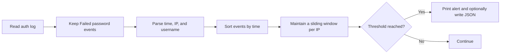

# SSH Brute Force Detector

[](https://github.com/destinesia7187/ssh-brute-force-detector/actions/workflows/tests.yml)
[](https://www.python.org/)
[](LICENSE)

**English** · [Қазақша](README_KK.md)

A Python command-line tool that detects bursts of failed SSH logins from a single source IP within a sliding time window. It parses authentication logs, prints alerts, and can export a structured JSON report for further analysis.

This is a defensive cybersecurity portfolio project. The included logs are synthetic and use IP ranges reserved for documentation.

## Detection rule

The default rule creates an alert when it finds **5 failed SSH logins from one IP address within any 5-minute window**.



The threshold and window are configurable. A successful login is ignored and does not reset the failed-attempt history.

## Features

- Parses ISO timestamps used by the sample data.
- Parses classic Linux `auth.log` timestamps such as `Sep 16 10:00:10`.
- Supports IPv4 and IPv6 and validates each source address.
- Tracks attempted usernames for every detected source.
- Uses a sliding time window independently for each IP.
- Exports JSON reports for automation or incident documentation.
- Maps the detection to MITRE ATT&CK `T1110.001` — Password Guessing.
- Uses only the Python standard library.

## Quick start

Requirements: Python 3.10 or newer.

```bash
git clone https://github.com/destinesia7187/ssh-brute-force-detector.git
cd ssh-brute-force-detector
python detector.py
```

Expected output:

```text
[ALERT] 198.51.100.23: 5 failed logins | 2026-09-16 10:00:10 - 10:04:30 UTC | users: admin, root, test | MITRE: T1110.001
```

On some Windows installations, use `py -3` instead of `python`.

## Usage

```text
python detector.py [LOG_FILE] [--threshold NUMBER] [--window MINUTES]
                   [--year YEAR] [--json OUTPUT_FILE]
```

Analyse the included sample and create a JSON report:

```bash
python detector.py sample_auth.log --threshold 5 --window 5 --json report.json
```

Analyse a classic Linux log whose timestamps do not include a year:

```bash
python detector.py /var/log/auth.log --year 2026
```

Show all options with `python detector.py --help`.

## Sample scenarios

| Source IP | Activity | Result |
|---|---|---|
| `192.0.2.10` | Two failures followed by a successful login | No alert |
| `198.51.100.23` | Five failures in 4 minutes 20 seconds | Alert |
| `203.0.113.7` | Five failures spaced 10 minutes apart | No alert |

The addresses above belong to documentation networks defined by RFC 5737 and do not represent real systems.

## How the sliding window works

For each IP, the detector stores recent failed attempts in a queue. When a new attempt arrives, entries older than the configured window are removed from the front. If the remaining queue reaches the threshold, the detector produces one alert for that IP.

Example with a threshold of 3 and a 5-minute window:

```text
10:00:10  admin  ┐
10:01:00  root   ├─ same IP, all inside 5 minutes → ALERT
10:02:00  root   ┘
```

Events are sorted before analysis, so the input file does not have to be in chronological order. An event exactly on the time-window boundary is included.

## JSON report

The JSON output records the rule configuration and evidence for each alert:

```json
{
  "ip": "198.51.100.23",
  "count": 5,
  "start": "2026-09-16T10:00:10Z",
  "end": "2026-09-16T10:04:30Z",
  "usernames": ["admin", "root", "test"],
  "mitre_attack": "T1110.001"
}
```

See the complete [example report](examples/report.example.json) and the [5W1H detection report](docs/DETECTION_REPORT.md).

## Project structure

```text
.
├── detector.py                 # Parser, detection logic, CLI, JSON export
├── sample_auth.log             # Synthetic authentication events
├── test_detector.py            # Unit tests
├── examples/report.example.json
├── docs/DETECTION_REPORT.md
├── docs/DETECTION_REPORT_KK.md
└── .github/workflows/tests.yml # Automated tests
```

## Testing

Run `python -m unittest -v`. The tests cover window boundaries, unordered events, custom thresholds, IPv6, Linux syslog parsing, invalid IP addresses, ignored successful logins, per-IP isolation, and JSON output. GitHub Actions runs them on Python 3.10, 3.11, and 3.12.

## MITRE ATT&CK mapping

| Field | Value |
|---|---|
| Tactic | Credential Access |
| Technique | Brute Force (`T1110`) |
| Sub-technique | Password Guessing (`T1110.001`) |
| Observable | Repeated failed SSH authentication from one source IP |

This mapping describes the behaviour the rule is intended to detect. An alert is evidence of repeated failures, not proof that an attacker compromised the system.

## Limitations

- The parser supports the two documented SSH log formats, not every Linux or SSH implementation.
- Classic syslog timestamps have no year or timezone; the year is supplied by the user and UTC is assumed.
- The entire input is loaded into memory before analysis.
- Only one alert per IP is emitted during one run.
- A shared NAT address can produce a false positive.
- Slow attacks and distributed attempts across many IPs can evade this rule.
- The tool does not monitor files in real time or block addresses.

## Responsible use

Use this project only with logs you are authorised to analyse. It reads local text files and does not connect to, scan, or modify remote systems.

## License

Released under the [MIT License](LICENSE).
