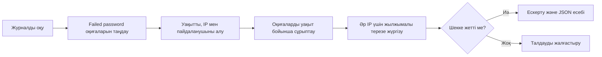

# SSH Brute Force Detector

[](https://github.com/destinesia7187/ssh-brute-force-detector/actions/workflows/tests.yml)
[](https://www.python.org/)
[](LICENSE)

[English](README.md) · **Қазақша**

Бір IP-мекенжайдан жылжымалы уақыт аралығында жасалған сәтсіз SSH кіру әрекеттерін анықтайтын Python пәрмен жолы құралы. Бағдарлама аутентификация журналдарын талдайды, ескерту шығарады және нәтижені JSON есебі ретінде сақтайды.

Бұл — қорғанысқа бағытталған киберқауіпсіздік портфолиосының оқу жобасы. Қосылған журналдар синтетикалық, ал IP-мекенжайлар құжаттамаға арналған диапазондардан алынған.

## Анықтау ережесі

Әдепкі ереже **бір IP-мекенжайдан кез келген 5 минут ішінде 5 сәтсіз SSH кіру әрекеті** табылса, ескерту жасайды.



Шек пен уақыт аралығын өзгертуге болады. Сәтті кіру есепке алынбайды және алдыңғы сәтсіз әрекеттер тарихын өшірмейді.

## Мүмкіндіктері

- Оқу деректеріндегі ISO уақыт белгісін талдайды.
- `Sep 16 10:00:10` түріндегі классикалық Linux `auth.log` пішімін қолдайды.
- IPv4 және IPv6 мекенжайларын қолдайды әрі олардың дұрыстығын тексереді.
- Әр анықталған IP үшін қолданылған пайдаланушы аттарын көрсетеді.
- Әр IP үшін жеке жылжымалы уақыт терезесін қолданады.
- Автоматтандыру мен инцидентті құжаттау үшін JSON есебін жасайды.
- MITRE ATT&CK `T1110.001` — Password Guessing техникасымен сәйкестендіреді.
- Тек Python стандартты кітапханасын пайдаланады.

## Жылдам бастау

Қажетті нұсқа: Python 3.10 немесе одан жаңасы.

```bash
git clone https://github.com/destinesia7187/ssh-brute-force-detector.git
cd ssh-brute-force-detector
python detector.py
```

Күтілетін нәтиже:

```text
[ALERT] 198.51.100.23: 5 failed logins | 2026-09-16 10:00:10 - 10:04:30 UTC | users: admin, root, test | MITRE: T1110.001
```

Кейбір Windows жүйелерінде `python` орнына `py -3` пәрменін қолданыңыз.

## Қолдану

```text
python detector.py [LOG_FILE] [--threshold NUMBER] [--window MINUTES]
                   [--year YEAR] [--json OUTPUT_FILE]
```

Оқу журналын талдап, JSON есебін жасау:

```bash
python detector.py sample_auth.log --threshold 5 --window 5 --json report.json
```

Уақыт белгісінде жыл көрсетілмейтін Linux журналын талдау:

```bash
python detector.py /var/log/auth.log --year 2026
```

Барлық параметрлерді көру үшін `python detector.py --help` пәрменін орындаңыз.

## Оқу сценарийлері

| Бастапқы IP | Әрекет | Нәтиже |
|---|---|---|
| `192.0.2.10` | Екі сәтсіз әрекеттен кейін сәтті кіру | Ескерту жоқ |
| `198.51.100.23` | 4 минут 20 секунд ішінде бес сәтсіз әрекет | Ескерту |
| `203.0.113.7` | Әрқайсысының арасы 10 минут болатын бес әрекет | Ескерту жоқ |

Бұл мекенжайлар RFC 5737 бойынша құжаттамаға арналған желілерге жатады және нақты жүйелерді білдірмейді.

## Жылжымалы уақыт терезесі қалай жұмыс істейді

Детектор әр IP үшін соңғы сәтсіз әрекеттерді кезекте сақтайды. Жаңа әрекет келгенде, белгіленген уақыт аралығынан ескі жазбалар кезектің басынан алынады. Қалған әрекеттер саны шекке жетсе, сол IP үшін бір ескерту жасалады.

Шек 3, уақыт терезесі 5 минут болғандағы мысал:

```text
10:00:10  admin  ┐
10:01:00  root   ├─ бір IP, барлығы 5 минут ішінде → ЕСКЕРТУ
10:02:00  root   ┘
```

Талдау алдында оқиғалар уақыт бойынша сұрыпталады. Сондықтан журналдағы жолдар хронологиялық ретте болмауы мүмкін. Уақыт терезесінің дәл шекарасындағы оқиға есепке алынады.

## JSON есебі

JSON файлы ереже параметрлері мен әр ескертудің дәлелдерін сақтайды:

```json
{
  "ip": "198.51.100.23",
  "count": 5,
  "start": "2026-09-16T10:00:10Z",
  "end": "2026-09-16T10:04:30Z",
  "usernames": ["admin", "root", "test"],
  "mitre_attack": "T1110.001"
}
```

Толық [есеп мысалын](examples/report.example.json) және [5W1H анықтау есебін](docs/DETECTION_REPORT_KK.md) қараңыз.

## Жоба құрылымы

```text
.
├── detector.py                 # Талдау, анықтау логикасы, CLI, JSON
├── sample_auth.log             # Синтетикалық аутентификация оқиғалары
├── test_detector.py            # Модульдік тесттер
├── examples/report.example.json
├── docs/DETECTION_REPORT.md
├── docs/DETECTION_REPORT_KK.md
└── .github/workflows/tests.yml # Автоматты тестілеу
```

## Тестілеу

`python -m unittest -v` пәрменін іске қосыңыз. Тесттер уақыт шекарасын, ретсіз оқиғаларды, өзгермелі шекті, IPv6-ны, Linux журналының пішімін, қате IP-ді, сәтті кіруді елемеуді, IP-лерді бөлек санауды және JSON есебін тексереді. GitHub Actions оларды Python 3.10, 3.11 және 3.12 нұсқаларында іске қосады.

## MITRE ATT&CK сәйкестігі

| Өріс | Мәні |
|---|---|
| Тактика | Credential Access |
| Техника | Brute Force (`T1110`) |
| Ішкі техника | Password Guessing (`T1110.001`) |
| Бақыланатын белгі | Бір IP-ден қайталанған сәтсіз SSH аутентификациясы |

Бұл сәйкестік ереже анықтауға арналған әрекетті сипаттайды. Ескерту қайталанған сәтсіз әрекеттердің дәлелі, бірақ жүйенің бұзылғанын дәлелдемейді.

## Шектеулері

- Талдағыш барлық Linux немесе SSH нұсқаларын емес, құжатталған екі журнал пішімін ғана қолдайды.
- Классикалық syslog уақытында жыл мен уақыт белдеуі жоқ; жылды пайдаланушы береді, ал уақыт UTC деп қабылданады.
- Талдау алдында кіріс файлы толық жадқа жүктеледі.
- Бір іске қосқанда әр IP үшін бір ғана ескерту беріледі.
- Ортақ NAT мекенжайы жалған оң нәтиже тудыруы мүмкін.
- Баяу немесе көптеген IP-ге бөлінген әрекет бұл ережеден өтіп кетуі мүмкін.
- Құрал нақты уақытта бақыламайды және IP-мекенжайларды бұғаттамайды.

## Жауапты пайдалану

Жобаны тек талдауға рұқсатыңыз бар журналдармен пайдаланыңыз. Бағдарлама жергілікті мәтіндік файлдарды оқиды, қашықтағы жүйелерге қосылмайды, оларды сканерлемейді және өзгертпейді.

## Лицензия

Жоба [MIT лицензиясымен](LICENSE) таратылады.
